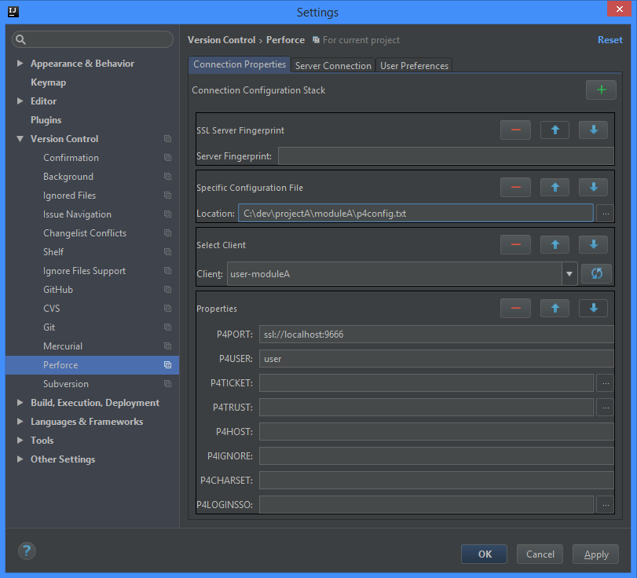
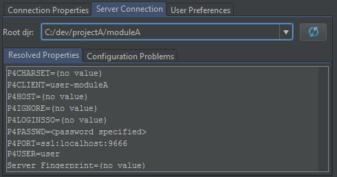

# Perforce IDEA Community Integration

### VCS support for Perforce

The plugin allows for associating an [IntelliJ IDEA Community Edition IDE](https://www.jetbrains.com/idea/)
project with a Perforce repository through IDEA's built-in VCS support.

**Currently Supported IDEA versions: 13.5 through 2016.2** *which includes Android Studio 1.0 and many other products.*
For a full list of supported products, please see
[the JetBrains plugin page](https://plugins.jetbrains.com/update/index?pr=&updateId=22898)

This is the compatibility branch for version 135.  The master branch is for compatibility with newer IDEs.

# Getting Started

1. Install the plugin by one of these methods:
    * From within IDEA
        1. Open the IDE settings dialog ( **File** -> **Settings...** ).
        1. Navigate to the **Plugins** panel.
        1. Click the **Browse repositories...** button.
        1. Select the **Perforce IDEA Community Integration** plugin.
    * Download and install from disk:
        1. Download from the
           [Jetbrains plugin center](http://plugins.jetbrains.com/plugin/7685)
           or from the [Github releases](https://github.com/groboclown/p4ic4idea/releases/latest)
        1. In IDEA, open the IDE settings dialog ( **File** -> **Settings...** ).
        1. Navigate to the Plugins panel.
        1. Click the **Install plugin from disk...** button.
        1. Select the downloaded zip file.
    * Build it yourself:
        1. Follow [the building guide](BUILDING.md) for details on setting up your
           environment and building the `p4ic4idea.zip` file.
        1. In IDEA, open the IDE settings dialog ( **File** -> **Settings...** ).
        1. Navigate to the Plugins panel.
        1. Click the **Install plugin from disk...** button.
        1. Select `p4ic4idea.zip` from the source root directory.
1. In IDEA, select the VCS root directory managed by Perforce.
    1. Open the IDE settings dialog ( **File** -> **Settings...** ).
    1. Select the **Version Control** panel.
    1. Select the root directory from the list (or add a new one), and choose
       "Perforce" from the drop-down selection.
1. Choose the Perforce connection method.
    1. From either the **Version Control** panel (select the pencil
       icon with the Perforce root selected), or the Perforce panel
       under the Version Control.
    1. Select the [connection settings](#connecting-to-your-perforce-server),
       and click **OK**.
    

# Setting Up The Plugin

In the Perforce configuration panel, you setup the connection information in
the [*Connection Properties* tab](#connecting-to-your-perforce-server).

You can check your configuration by looking at the
[*Server Connection* tab](#checking-connection-properties).  This
allows you to see how the plugin resolves the connection properties by the
identified root directories.

The [*User Preferences* tab](#user-preferences) allows you to tweak how the
plugin interacts with the server, and how the plugin displays information to
you.

## Connecting to Your Perforce Server

The configuration shows you a list of configuration parameters.  It's ordered, so
the plugin uses the properties at the top before the lower ones.

You'll start by adding a new property category with
the  button.
A category can be removed with
the  button,
and reordered with
the  and
the  buttons.

You can see how the plugin evaluates the properties across your project by
viewing the [*Server Connection* tab](#checking-connection-properties).

For most people, the [environment variables](#environment-variables) will be
sufficient to use the same mechanism to connect to the Perforce server as
what the command-line `p4` tool does.  However, you may need to explicitly
set the [property values](#property-values), or use a [file](#file) that
contains the settings.

For SSL, you will want to use a `P4PORT` setting that starts with `ssl://`
(such as `ssl://perforce:1666`).  If you have the server registered in the
authorized hosts, then make sure that `P4TRUST` setting points to that file;
or you can add a [SSL server fingerprint](#ssl-server-fingerprint) setting
to explicitly state the expected SSL fingerprint.

### Property Values

The *Properties* configuration allows you to explicitly define the connection
details.  You can leave fields blank if you don't need to use the value.  These
values have the same meaning as the
[Perforce environment variables](https://www.perforce.com/perforce/doc.051/manuals/p4guide/ab_envvars.html).

You'll notice that the `P4PASSWD` setting is not present.  If you don't use a
`P4TICKET` for authorization, the plugin will prompt you for your password.  This
allows the plugin to use the IDE's password storage mechanism.

### Client Name

You can type in your client name in the field, or press
the  button
to load the drop-down with the clients in your name on the server.  This will
use the other settings to connect to the server.

### Environment Variables

Loads the properties from the environment variables *from the shell that
launched the IDE*.

In Windows, this will also attempt to inspect your Perforce registry variables.  

### File

Load the properties from a specific file.  The format for the file is the
same as a `P4CONFIG` or `P4ENVIRO` file.

### Relative File (P4CONFIG)

Similar to the [File](#file) setting, but works like a `P4CONFIG` environment
variable.  The project directories are scanned for files matching the relative
file name, allowing for a single project to span multiple clients or server
connections.

### SSL Server Fingerprint

If you are connecting to an SSL server and are not using a `P4TRUST` file,
then use this field to declare the server fingerprint for authorizing the
connection to the server. 

### Require a Password

This ignores the `P4TICKET` settings and requires you to enter the password.

## Checking Connection Properties

The *Server Connection* tab allows you to review the resolved properties for 
each identified root directory.  Press
the  button
to re-examine the configuration properties and look for root directories.

## User Preferences

The *User Preferences* tab allows you to change the general operation of the
plugin. 

# Workflow

With your working Perforce connections specified, you can use the IDE
as usual.  Editing files will check them out from the server.  Moving
or renaming files will trigger a P4 rename operation.  Deleting files
will delete them from the server.  All edited files will show up in
the IntelliJ change lists, and those will be associated with the
corresponding Perforce change.

From the change lists, you can view a difference against the head
revision.  You can also view the file history, and compare different
revisions against each other.

When submitting a changelist, you may associate Perforce jobs with the
changelist, and set the job status.  This association will only be used
when the changelist is actually submitted.
