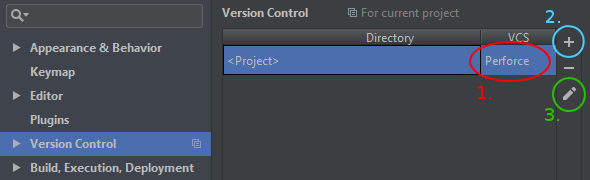
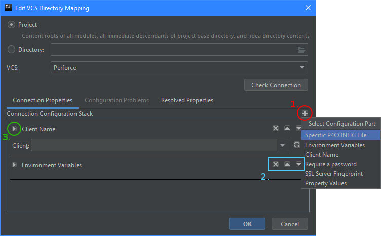
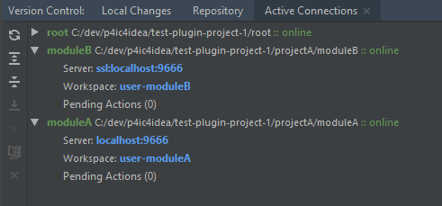

# Perforce IDEA Community Integration

### VCS support for Perforce

The plugin allows for associating an [IntelliJ IDEA Community Edition IDE](https://www.jetbrains.com/idea/)
project with a Perforce repository through IDEA's built-in VCS support.

**Currently Supported IDEA versions: 2017.1 and above**
For a full list of supported products, please see
[the JetBrains plugin page](https://plugins.jetbrains.com/update/index?pr=&updateId=22898)

Compatibility with earlier IDE versions is supported up to the 0.9.6 release.  It is maintained
in the `135-compat` branch.

* [Getting Started](#getting-started)
* [Setting Up The Plugin](#setting-up-the-plugin)
* [Workflow](#workflow)
* [Compatibility Issues](#compatibility-issues)
* [License](#license)
* [Future Roadmap](TODO.md)
* [Contribute](#contributing)

# Getting Started

1. Install the plugin by one of these methods:
    * From within IDEA
        1. Open the IDE settings dialog ( **File** -> **Settings...** ).
        1. Navigate to the **Plugins** panel.
        1. Click the **Browse repositories...** button.
        1. Select the **Perforce IDEA Community Integration** plugin.
    * Download and install from disk:
        1. Download from the
           [Jetbrains plugin center](http://plugins.jetbrains.com/plugin/7685)
           or from the [Github releases](https://github.com/groboclown/p4ic4idea/releases/latest)
        1. In IDEA, open the IDE settings dialog ( **File** -> **Settings...** ).
        1. Navigate to the Plugins panel.
        1. Click the  icon, and select the
           **Install plugin from disk...** item from the pop-up menu.
        1. Select the downloaded file from the file selection dialog.
    * Build it yourself:
        1. Follow [the building guide](BUILDING.md) for details on setting up your
           environment and building the `p4ic4idea-plugin.jar` file.
        1. In IDEA, open the IDE settings dialog ( **File** -> **Settings...** ).
        1. Navigate to the Plugins panel.
        1. Click the  icon, and select the
           **Install plugin from disk...** item from the pop-up menu.
        1. Select the downloaded file from the file selection dialog.
1. In IDEA, [configure the VCS root directory managed by Perforce and its connection properties](#setting-up-the-plugin).

# Setting Up The Plugin

## Select VCS Root Directories

To view the Version Control settings, open the IDE settings dialog ( **File** -> **Settings...** ) and select the
**Version Control** panel.

In the Version Control settings, you will need to define the root directories that are under Perforce control.  Any
file in your project outside one of these root directories won't be managed by Perforce.  You can have multiple
directories here, each with their own or shared server connection settings.

To bring a VCS root directory under Perforce control, use the VCS provider drop-down (marked **1.** in the image above)
for each root directory, and select "Perforce".  To add another directory, use the side toolbar "+" button
(marked **2.** in the image above).

Then, you will need to [configure the connection settings](#connecting-to-your-perforce-server) for each Perforce
controlled root directory by pressing the  button in the side
toolbar.

## Connecting to Your Perforce Server

The configuration dialog allows you to configure the VCS root directory, the VCS provider, and connection information
specific to that provider.

For the p4ic4idea plugin, this is where you configure how the root directory finds the Perforce server.  You can
configure each root directory to point to different servers or client workspaces, or have them reference the same
workspaces.  However, any file outside the root directory will not be considered for Perforce operations.

The **Connection Configuration Stack** under the **Connection Properties** tab shows the ordered list of connection
settings; the plugin uses the settings at the top before the lower ones.

By default, the plugin selects the [environment variables](#environment-variables) settings.  These should connect to
the server using the same mechanism as the `p4` command line tool.  It won't, however, read `P4CONFIG` values due to
limitations in the plugin.  On Windows computers, it also won't read any password value you have stored in the registry.

If you need different settings, you can add them with the "plus" button (**1.** in the image above).  This brings up a
list of types of settings to add to the stack:

* [Specific P4CONFIG File](#specific-p4config-file)
* [Environment Variables](#environment-variables)
* [Client Name](#client-name)
* [Require a password](#require-a-password)
* [SSL Server Fingerprint](#ssl-server-fingerprint)
* [Property Values](#property-values)

The stack order can be changed with the "remove", "up", and "down" buttons (**2.** in the image above).  You can view
detailed information about the settings entry by expanding the arrow button (**3.** in the image above).

You can see how the plugin evaluates the properties across your project by viewing the
[*Resolved Properties* tab](#checking-connection-properties).  Press the **Check Connection** button to evaluate the
settings for problems, which can be viewed in the **Configuration Problems** tab, if any are found.

For SSL, you will want to use a `P4PORT` setting that starts with `ssl://` (such as `ssl://perforce:1666`).  If you
have the server registered in the authorized hosts, then make sure that `P4TRUST` setting points to that file;
or you can add a [SSL server fingerprint](#ssl-server-fingerprint) setting to explicitly state the expected SSL
fingerprint.

### Property Values

The *Properties* configuration allows you to explicitly define the connection details.  You can leave fields blank if
you don't need to use the value.  These values have the same meaning as the
[Perforce environment variables](https://www.perforce.com/perforce/doc.051/manuals/p4guide/ab_envvars.html).

You'll notice that the `P4PASSWD` setting is not present.  If you don't use a `P4TICKET` for authorization, the plugin
will prompt you for your password.  This allows the plugin to use the IDE's password storage mechanism.

### Client Name

You can type in your client name in the field, or press the refresh button to load the drop-down with the clients in
your name on the server.  This will use the other settings to connect to the server.

### Environment Variables

Loads the properties from the environment variables *from the shell that launched the IDE*.

In Windows, this will also attempt to inspect your Perforce registry variables.

For users on Macintosh, the plugin does not currently check the user's `com.perforce.environment` property list in the
`~/Library/Preferences` folder.

### Specific P4CONFIG File

Load the properties from a specific file.  The format for the file is the same as a `P4CONFIG` or `P4ENVIRO` file.

### SSL Server Fingerprint

If you are connecting to an SSL server and are not using a `P4TRUST` file, then use this field to declare the server
fingerprint for authorizing the connection to the server. 

### Require a Password

This ignores the `P4TICKET` settings and any password you may have stored in a configuration file or registry, and
requires you to enter the password.  The password you enter will be stored through the IDE's password storage
mechanism.

## Checking Connection Properties

The *Resolved Properties* tab allows you to review the resolved properties for the current VCS root.  The
**Check Connection** button will refresh the list.  Note that passwords are never shown.

## User Preferences

The *User Preferences* tab allows you to change the general operation of the
plugin. 

*Note: This section needs updates to reflect the new 0.10 version of the plugin.*

**WARNING** This dialog does not reflect the list of user-configurable properties for v0.10 of the plugin.
Future releases will fix this.  If you want to help, see bug #178.

# Workflow

With your working Perforce connections specified, you can use the IDE as usual.  Editing files will check them out from
the server.  Moving or renaming files will trigger a P4 rename operation.  Deleting files will delete them from the
server.  All edited files will show up in the IntelliJ change lists, and those will be associated with the
corresponding Perforce change.

From the change lists, you can view a difference against the head revision.  You can also view the file history, and
compare different revisions against each other.

When submitting a changelist, you may associate Perforce jobs with the changelist, and set the job status.  This
association will only be used when the changelist is actually submitted.

You can view the active server connections for your project through the **Version Control** panel, in the "Active
Connections" tab.

If you are working disconnected from the server, Perforce requests are queued up in the "Pending Actions" list.  You
can also use this view to reconnect to a server, disconnect from a server, configure a VCS root folder configuration,
and manage the pending actions list. 

# Compatibility Issues

## Symlinks on Windows

Perforce supports creating a "symlink" file.  If you're running your client on
Windows, you can does support the creation of symlinks, but you need to enable
special permissions to allow your user to create symlinks.
See [this article on superuser.com](https://superuser.com/questions/104845/permission-to-make-symbolic-links-in-windows-7)
for details on how to do this.

# Contributing

You can help make the plugin better!

## Submit Bug Reports

Submitting bug reports is the easiest way to help improve the plugin.  Bugs can't be fixed if they aren't known.

Please note that issues with the "0.9" label only affect the `135-compat` branch.

## Fix It Yourself

See [BULDING.md](BUILDING.md) for information on downloading the source and building the plugin.  Additional
documentation regarding the inner-workings of the plugin are in the
[docs/dev](docs/dev/README.md) directory.  

## Looking For Work?

Please see the bug list for the project, and the [TODO.md] file for details on the future direction of the plugin.

# License

The plugin is released under the [Apache 2.0 license](LICENSE).  It includes modifications to code from:

* [p4java](p4java/LICENSE-p4java.txt), released under a 2-clause BSD license by Perforce Software, Inc.
